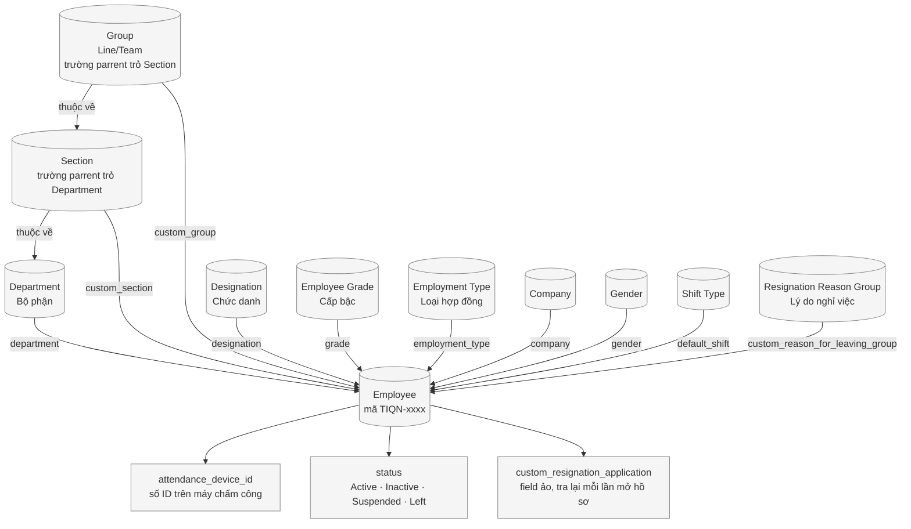
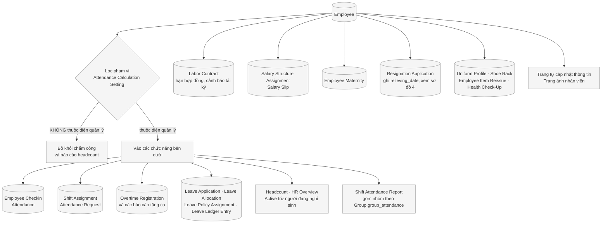
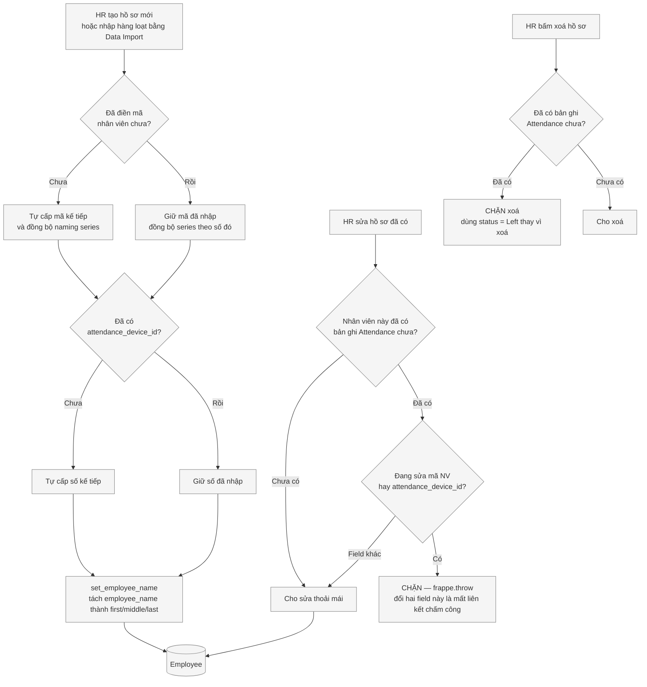
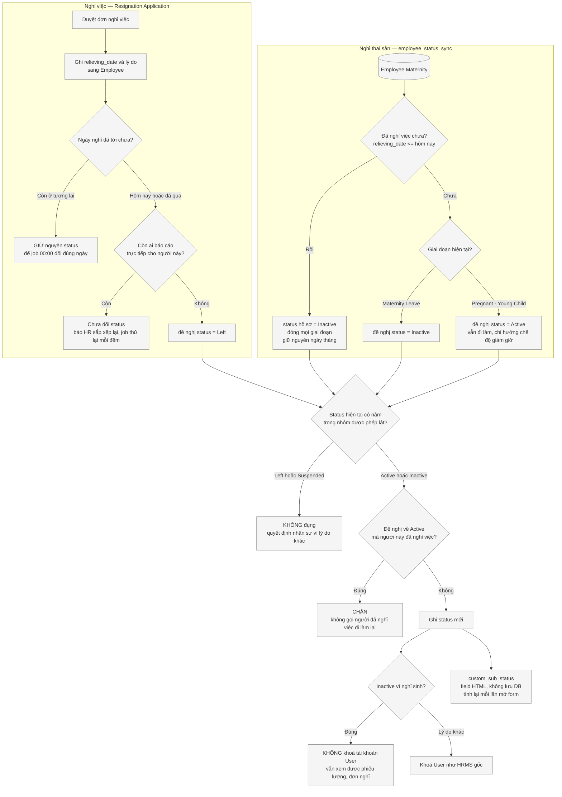

# Flowchart — Hồ sơ nhân viên (Employee)

> **Mục đích:** Employee là gốc của mọi thứ khác — chấm công, lương, phép, báo cáo. Sơ đồ này cho thấy hồ sơ được dựng từ đâu, ai được sửa gì, và đi tiếp vào những chức năng nào.
> **Phạm vi:** DocType `Employee` và các doctype tổ chức đi kèm
> **Trạng thái:** Đang chạy · **Cập nhật:** 2026-08-21

Sơ đồ **phản ánh hệ thống đang chạy thật**. Tên doctype và tên field giữ nguyên tiếng Anh như
HRMS hiển thị; giải thích viết tiếng Việt. Số liệu trong bài đo ngày **21/08/2026** trên
production: **2.437 hồ sơ** (1.048 `Active`, 1.389 `Left`).

---

## 1. Thông tin nhân viên — hồ sơ được dựng từ đâu

> Nguồn: `erpnext/setup/doctype/employee/employee.json` \(field Link chuẩn\) · `fixtures/custom_field.json` \(field Link tự thêm\) · `overrides/employee/employee_override.py` \(property `custom_resignation_application`\) · `customize_erpnext/doctype/section/section.json` · `customize_erpnext/doctype/group/group.json` \(trường `parrent`, `group_attendance`\) · `overrides/employee/employee_override.py` \(CustomEmployee.set_employee_name\) · `api/employee/employee_validation.py` \(before_insert_employee\)

> **Toàn bộ 26 field kiểu Link trên Employee.** Sơ đồ vẽ 10 field đầu vào đang có dữ liệu; số còn
> lại hoặc là dẫn xuất, hoặc khai báo sẵn mà **chưa dùng** — liệt kê ở đây để khỏi phải mở form đi
> tìm. Cột cuối là số hồ sơ thực có giá trị, đo ngày 21/08/2026 trên 2.437 hồ sơ:
>
> | Field | Trỏ tới | |
> |---|---|---|
> | `company` | Company | bắt buộc |
> | `gender` | Gender | bắt buộc |
> | `department` | Department | bắt buộc |
> | `custom_section` | Section | |
> | `custom_group` | Group | |
> | `designation` | Designation | |
> | `grade` | Employee Grade | |
> | `default_shift` | Shift Type | |
> | `employment_type` | Employment Type | |
> | `salary_currency` | Currency | |
> | `user_id` | User | |
> | `custom_uniform_profile` | Employee Uniform Profile | |
> | `custom_reason_for_leaving_group` | Resignation Reason Group | |
> | `reports_to` | Employee | **chưa dùng** |
> | `holiday_list` | Holiday List | **chưa dùng** |
> | `branch` | Branch | **chưa dùng** |
> | `salutation` | Salutation | **chưa dùng** |
> | `job_applicant` | Job Applicant | **chưa dùng** |
> | `leave_approver` · `expense_approver` · `shift_request_approver` | User | **chưa dùng** |
> | `payroll_cost_center` | Cost Center | **chưa dùng** |
> | `employee_advance_account` | Account | **chưa dùng** |
> | `health_insurance_provider` | Employee Health Insurance | **chưa dùng** |
> | `custom_reason_for_leaving_group_2` | Resignation Reason Group 2 | **chưa dùng** |
> | `custom_resignation_application` | Resignation Application | **field ảo** |

> **Ô chọn nối tầng — lọc khoan dung, có lý do.** Trên form Employee, chọn `department` thì
> `custom_section` chỉ còn các Section thuộc bộ phận đó; chọn `custom_section` thì `custom_group`
> lọc theo. Đổi cha mà con không còn thuộc cha mới thì con **được xoá kèm thông báo**.
>
> ⚠ Bộ lọc nhận **cả bản ghi có `parrent` rỗng**, không lọc cứng. Đo 22/08/2026: **13/27 Section**
> và **11/63 Group** chưa khai `parrent`. Lọc cứng sẽ giấu mất chúng khỏi ô chọn — HR không nhập
> được người mới vào những tổ ấy, tức là filter còn hại hơn không có. Khai đủ `parrent` rồi thì
> bỏ chuỗi rỗng khỏi hai bộ lọc trong `public/js/custom_scripts/employee.js` để siết lại.

> **Ba điểm khác HRMS gốc:**
>
> | Điểm | Thực tế ở TIQN |
> |---|---|
> | Cây tổ chức | **Department → Section → Group**, hai cấp dưới là doctype tự phát triển. Trường liên kết tên là `parrent` \(sai chính tả, đã đi vào dữ liệu — đừng đổi\) |
> | `employee_name` | Là **nguồn**; `first_name` / `middle_name` / `last_name` là **dẫn xuất** và đã ẩn khỏi form. HRMS gốc làm ngược lại — ghép 3 phần đè lên full name, khiến đổi tên qua Data Import hoặc API **im lặng không ăn** |
> | `reports_to` | **Không hồ sơ nào** có giá trị. Sơ đồ tổ chức của HRMS dựa vào field này nên **không dùng được**; quan hệ thật nằm ở Department/Section/Group |

> ⚠ `custom_resignation_application` là **field ảo** \(`is_virtual = 1`\): không có cột trong DB,
> giá trị tra lại mỗi lần mở hồ sơ bằng property trên `CustomEmployee`. Nó trỏ tới đơn nghỉ việc
> **đã duyệt** — rút đơn là link tự biến mất, không cần hook dọn. Đánh đổi: **không lọc, không sắp
> xếp, không đưa vào report được**; cần lọc theo đơn thì query thẳng `Resignation Application`.
>
> ⚠ `holiday_list` trên Employee cũng **không dùng** — HRMS v16.15+ đã chuyển sang doctype
> **Holiday List Assignment** gán ở cấp Company. Hook `set_default_holiday_list` đã bị bỏ.
> Đừng khai lại field cũ đó.

---

## 2. Hồ sơ đi tiếp vào đâu

> Nguồn: `api/headcount.py` \(employee_scope_sql, employee_scope_filters, active_employees, maternity_leave_employees, net_headcount\) · `customize_erpnext/doctype/attendance_calculation_setting/attendance_calculation_setting.py` \(get_excluded_employee_ids\) · `customize_erpnext/report/shift_attendance_customize/scheduler.py` \(_get_employee_prefix\) · `api/hr_overview_cards.py` · `www/employee-self-update-info/` · `www/employee-photos/`

> **Những doctype thật sự dùng Employee.** Mỗi dòng là một nơi hồ sơ nhân viên trở thành dữ liệu
> nghiệp vụ. Còn nhiều doctype chuẩn của ERPNext/HRMS cũng có field trỏ về `Employee` nhưng công
> ty chưa dùng \(Timesheet, Travel Request, Training, Vehicle Log, Retention Bonus, Overtime
> Slip…\) — không liệt kê ở đây để khỏi loãng.
>
> | Nhóm | Doctype |
> |---|---|
> | **Chấm công** | `Employee Checkin` · `Attendance` · `Shift Assignment` · `Attendance Request` |
> | **Tăng ca** | `Overtime Registration` \(+ bảng con `Overtime Registration Detail`\) |
> | **Nghỉ phép** | `Leave Application` · `Leave Allocation` · `Leave Policy Assignment` · `Leave Ledger Entry` |
> | **Hợp đồng · nghỉ việc** | `Labor Contract` · `Resignation Application` |
> | **Lương** | `Salary Structure Assignment` · `Salary Slip` |
> | **Chế độ** | `Employee Maternity` · `Health Check-Up` |
> | **Cấp phát** | `Employee Uniform Profile` · `Employee Item Reissue` · `Shoe Rack` |
> | **Tự cập nhật** | `Employee Self Update Info` · `Employee Self Update Form` |

> **Báo cáo đọc Employee:** `Shift Attendance Customize` · `OT Compliance` ·
> `Overtime Registration` \(3 biến thể\) · `Labor Contract Report` · `Employee Maternity Report` ·
> `Employee Item Reissue`.
>
> **Job theo lịch động tới Employee:** `auto_mark_employees_as_left` \(00:00, đổi status sang
> `Left`\) và `scheduled_calculate_all_maternity_statuses` \(00:10, tính lại giai đoạn thai sản\).
> **Thứ tự này bắt buộc**: người tới ngày nghỉ việc phải mang `Left` trước, rồi maternity mới đóng
> giai đoạn của họ trong cùng một đêm. Đổi giờ một trong hai thì giữ nguyên thứ tự.

> **Phạm vi đếm không phải "tất cả Employee".** Hai bộ lọc nằm ở `Attendance Calculation Setting`:
>
> | Cài đặt | Việc |
> |---|---|
> | `employee_id_prefix` | Chỉ tính mã bắt đầu bằng tiền tố này. Để trống = không lọc |
> | `exclude_employee_ids` | Danh sách mã bỏ ra — nhân sự công ty khác làm việc tại nhà máy, có quét vân tay nhưng không thuộc diện mình quản lý. Tách bằng dấu phẩy **hoặc** khoảng trắng |
>
> Mọi báo cáo headcount đều phải đi qua bộ lọc này. Viết truy vấn `tabEmployee` thẳng mà quên
> nó là ra số khác với dashboard.

> ⚠ **Headcount luôn trừ người đang nghỉ thai sản**: `Active` − `Maternity Leave`
> \(DISTINCT theo nhân viên\). Dùng lại `api/hr_overview_cards.py::net_headcount()`, đừng viết
> công thức mới.

---

## 3. Tạo và sửa hồ sơ — những chỗ hệ thống chặn

> Nguồn: `hooks.py` \(doc_events."Employee": before_insert, validate, on_trash\) · `api/employee/employee_validation.py` \(before_insert_employee, validate_employee_changes, prevent_employee_deletion, split_employee_name_parts\) · `overrides/employee/employee_override.py` \(CustomEmployee.set_employee_name\)

> **Vì sao khoá hai field đó.** `attendance_device_id` là số nhân viên đăng ký trên máy chấm
> công; mọi lần quét vân tay móc vào số này. Đổi nó khi đã có dữ liệu chấm công là cắt đứt
> liên kết giữa người và lịch sử quét của họ. Mã nhân viên cũng vậy: `Attendance`,
> `Leave Application`, `Salary Slip` đều trỏ về nó.
>
> Muốn đổi thật thì có cửa mở riêng — `allow_change_name_attendance_device_id()`.

> ⚠ Ba việc HRMS gốc làm sau khi tạo hồ sơ hiện **đang TẮT** trong `hooks.py`, còn nguyên
> dạng comment: đồng bộ sang MongoDB, tạo Uniform Profile, và **tạo Labor Contract thử việc
> đầu tiên**. Cái thứ ba chờ setup xong Salary Structure mới bật lại
> \(xem `customize_erpnext/doctype/labor_contract/labor_contract.md` mục 10\).

---

## 4. Trạng thái hồ sơ — ai được đổi và đổi khi nào

> Nguồn: `customize_erpnext/doctype/employee_maternity/employee_status_sync.py` \(sync_employee_status, FLIPPABLE_STATUSES, PHASE_PRIORITY, is_inactive_for_maternity, get_employee_sub_status\) · `customize_erpnext/doctype/resignation_application/resignation_application.py` \(sync_to_employee, revert_employee, mark_employee_left\) · `overrides/employee/employee.py` \(auto_mark_employees_as_left — job 00:00\) · `customize_erpnext/doctype/employee_maternity/employee_maternity.py` \(_has_left, calculate_status\) · `overrides/employee/employee_override.py` \(CustomEmployee.update_user_status\) · `hooks.py` \(doc_events."Employee Maternity", scheduler_events\)

> **Hai nguồn đổi status, một cửa ghi.** Cả thai sản lẫn nghỉ việc đều chỉ *đề nghị* trạng thái;
> cùng đi qua một chốt `FLIPPABLE_STATUSES = ("Active", "Inactive")`. `Left` và `Suspended` là
> quyết định của HR vì lý do khác — ghi đè lên là sai.

> 🔴 **`FLIPPABLE_STATUSES` KHÔNG đủ để bảo vệ người đã nghỉ việc.** Job 00:00 chỉ quét người đang
> `Active`, mà người nghỉ thai sản mang `Inactive` → tới ngày nghỉ việc họ **không** được đổi sang
> `Left`, vẫn nằm trong nhóm được phép lật. Khi giai đoạn thai sản đóng lại, nhánh
> "rời `Maternity Leave` → trả về `Active`" sẽ vớ đúng nhóm này và **cho người đã nghỉ việc đi làm
> lại trên giấy tờ**. Vì vậy `_set_employee_status()` có thêm chốt thứ hai: đề nghị `Active` mà
> `relieving_date` đã qua thì bỏ qua.

> 🔴 **Điều kiện "đã nghỉ việc" phải đọc `relieving_date`, không phải `status == 'Left'`** — cùng
> lý do trên. Xem `_has_left()`; "còn làm tại ngày X" là `relieving_date > X`.

> 🔴 **`Employee.status` trên site này là `"Left "` — CÓ DẤU CÁCH ở cuối, 1.393 bản ghi.** MySQL so
> sánh kiểu PAD SPACE nên `WHERE status = 'Left'` vẫn khớp và không ai phát hiện ra, nhưng trong
> Python `"Left " == "Left"` là **False**. Mọi so sánh status bằng Python phải `.strip()`.

> 🔴 **Duyệt đơn nghỉ việc cho ngày ở TƯƠNG LAI thì KHÔNG đổi status ngay.** `status = 'Left'` là
> công tắc cả hệ thống đang đọc: engine chấm công ngừng tính công, phép năm ngừng cấp. Duyệt ngày
> 01/09 cho ngày nghỉ 30/09 mà đổi luôn thì **29 ngày còn lại mất công**. Nên duyệt đơn chỉ ghi
> `relieving_date` + lý do; job 00:00 mới đổi status đúng vào ngày người ta thật sự nghỉ.
>
> ⚠ `relieving_date` là **ngày ĐẦU TIÊN không còn đi làm**, không phải ngày làm cuối cùng. Lệch
> một ngày ở đây là lệch một công.

> **Một nhân viên có thể có nhiều hồ sơ thai sản** \(chu kỳ thứ hai, hoặc trùng lặp\). `PHASE_PRIORITY`
> quyết bản nào thắng: `Maternity Leave` \(0\) → `Pregnant` \(1\) → `Young Child` \(2\) →
> `Inactive` \(3\). Bản có status rỗng **không bao giờ thắng**.

> 🔴 **`Inactive` vì nghỉ sinh KHÔNG được khoá tài khoản.** HRMS gốc khoá `User` mỗi khi
> `status != Active`. Người nghỉ thai sản vẫn cần đăng nhập xem phiếu lương và đơn nghỉ, nên
> `update_user_status()` bỏ qua đúng trường hợp này.

---

## Bảng thuật ngữ

| Tên trong hệ thống | Nghĩa |
|---|---|
| `Employee` | Hồ sơ nhân viên, mã dạng `TIQN-xxxx` |
| `Department` · `Section` · `Group` | Ba cấp tổ chức, nối nhau bằng trường `parrent` |
| `Group.group_attendance` | Nhóm hiển thị trên báo cáo chấm công: Pro-Sewing, Pro-Preparation, Pro-QAQC, Pro-Other, Engineering, Office, Canteen |
| `attendance_device_id` | Số nhân viên đăng ký trên máy chấm công — khoá nối với mọi lần quét |
| `default_shift` | Ca mặc định, dùng khi không có Shift Assignment cho ngày đó |
| `status` | `Active` · `Inactive` · `Suspended` · `Left` — ⚠ giá trị trong DB là `"Left "` có dấu cách |
| `custom_sub_status` | Field HTML chỉ để hiển thị, tính từ Employee Maternity, **không có cột trong DB** |
| `custom_probation_days` | Số ngày thử việc, dùng cho phép năm và thuế TNCN |
| `custom_si_base` | Mức lương đóng bảo hiểm, nằm trên Salary Structure Assignment |

## Chỗ hệ thống CHƯA có — đừng vẽ vào sơ đồ

- **Không** dùng `reports_to`, nên **không** có sơ đồ tổ chức theo cấp quản lý
- **Không** tự tạo Labor Contract khi thêm nhân viên mới — hook còn ở dạng comment
- **Không** tự tạo Uniform Profile khi thêm nhân viên mới — hook còn ở dạng comment
- `Employee Dependent` \(người phụ thuộc, dùng cho giảm trừ thuế TNCN\) mới có doctype,
  **0 bản ghi** — xem `overrides/payroll_docs/PLAN_EMPLOYEE_DEPENDENT.md`
