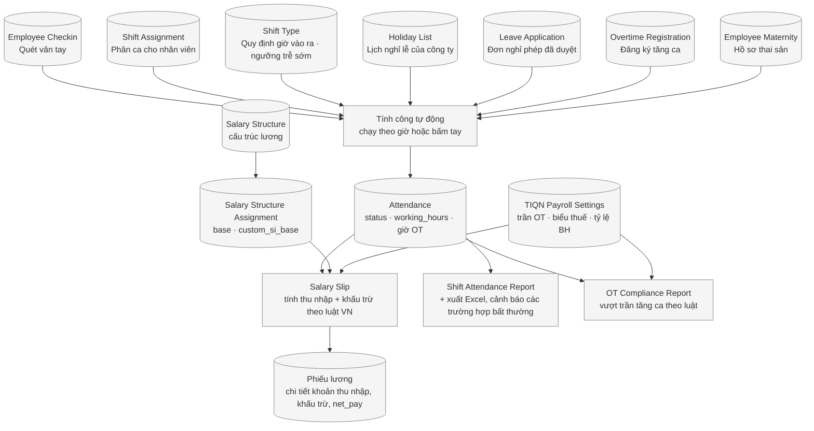
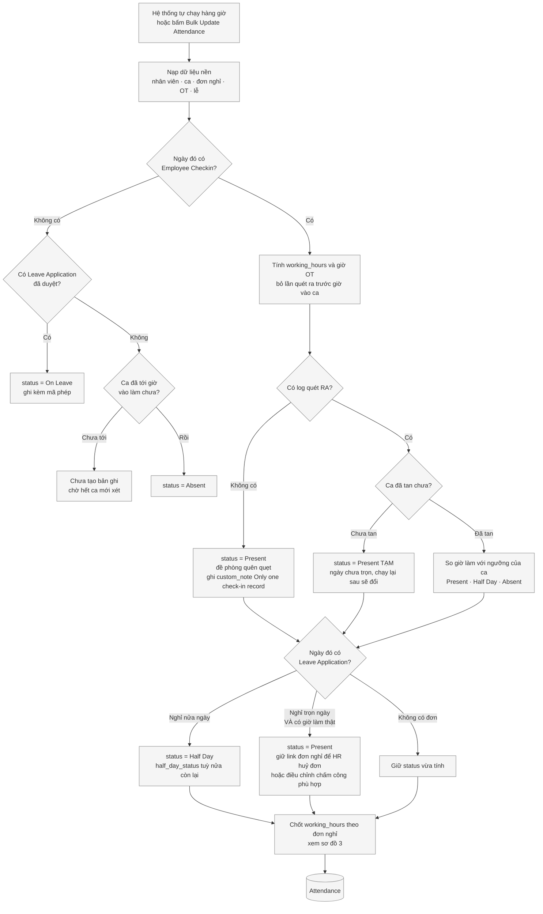
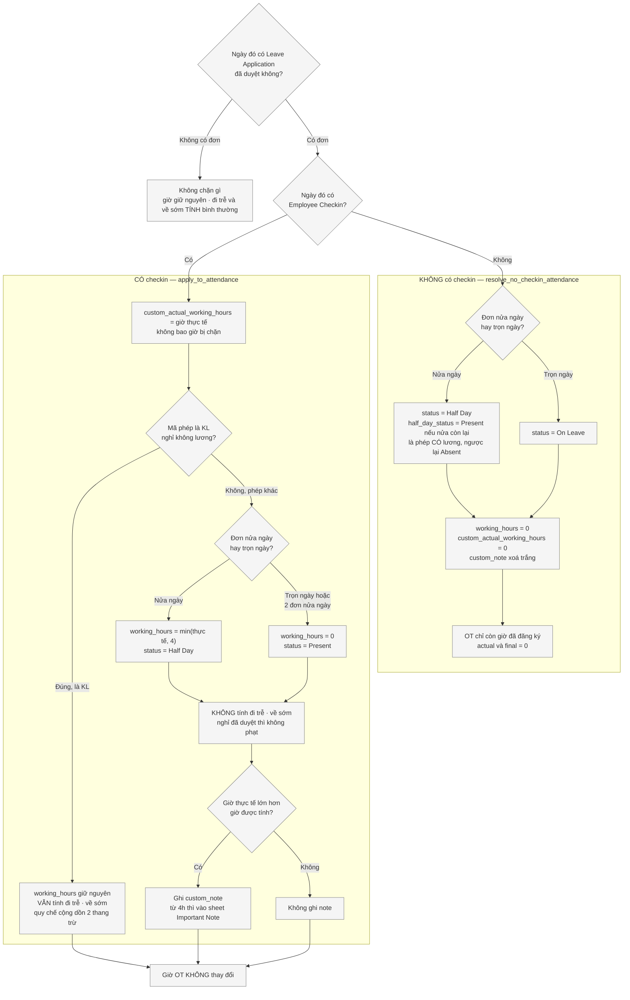
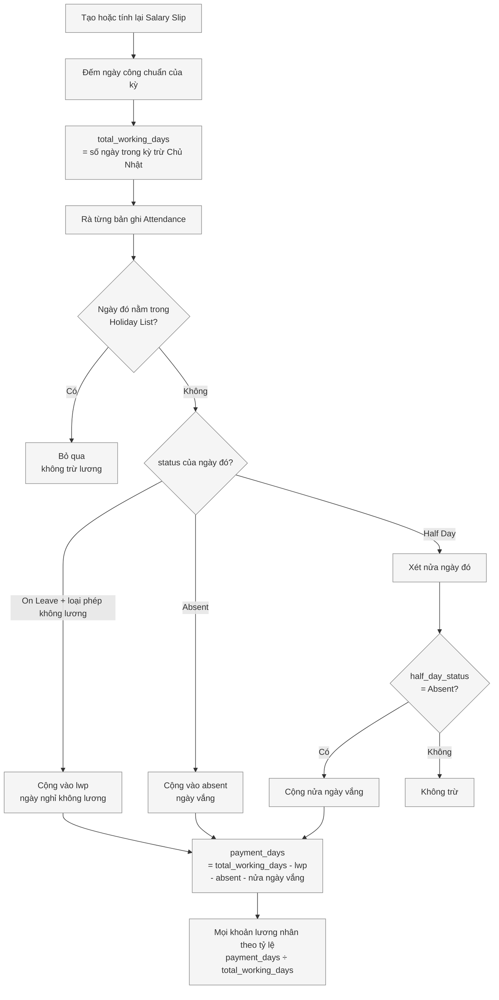
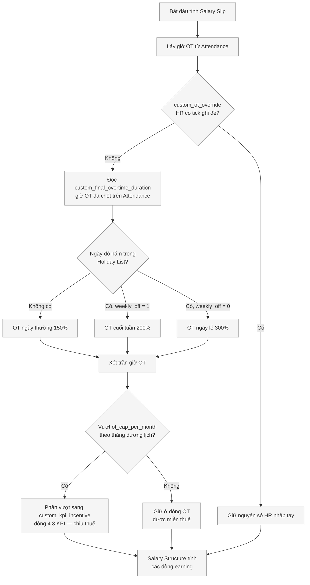
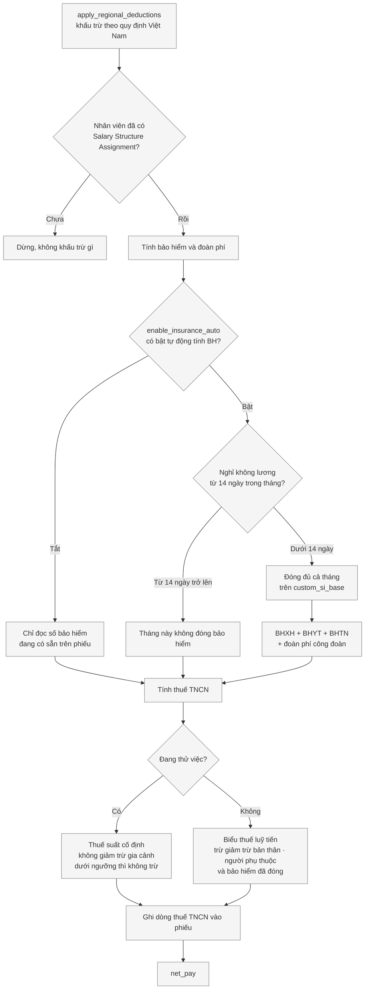
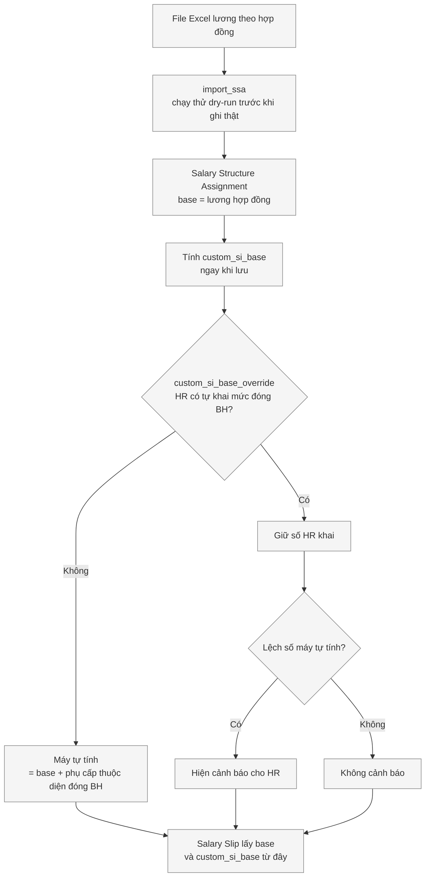
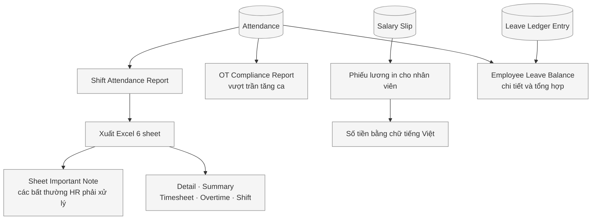

# Flowchart — Toàn bộ luồng chấm công, tính lương TIQN

> **Mục đích:** Sơ đồ **phản ánh hệ thống đang chạy thật**, không phải quy trình mong muốn.
> **Phạm vi:** Sơ đồ luồng
> **Trạng thái:** Đang chạy · **Cập nhật:** 2026-08-19

Sơ đồ **phản ánh hệ thống đang chạy thật**, không phải quy trình mong muốn. Mỗi khối là một
bước máy thực sự làm; mỗi hình thoi là một điều kiện máy thực sự kiểm.

Tên doctype, tên trường và các trạng thái giữ nguyên **tiếng Anh như HRMS hiển thị** — đúng chữ
HR nhìn thấy trên màn hình; phần giải thích bên dưới mỗi tên viết bằng tiếng Việt. Bảng thuật
ngữ ở cuối trang. Dòng **Nguồn** ghi file và hàm trong mã nguồn để người lập trình kiểm lại khi
sửa code, HR không cần đọc dòng đó.

Xem sơ đồ: **`/dev-tool` → tab Flowchart**. Muốn tự kéo lại bố cục thì bấm *Copy mã Mermaid*
rồi dán vào draw.io qua **Extras ▸ Edit Diagram…** (dán từng sơ đồ một).

---

## 1. Toàn cảnh — từ dữ liệu thô đến phiếu lương

> Nguồn: `overrides/shift_type/shift_type_optimized.py` \(bulk_update_attendance_optimized, preload_reference_data §3·§4·§6·§7·§8\) · `overrides/salary_slip/salary_slip.py` \(CustomSalarySlip\) · `overrides/payroll/vn_deductions.py` \(apply_regional_deductions\) · `hooks.py` \(override_doctype_class, regional_overrides\) · `customize_erpnext/report/ot_compliance/ot_compliance.py` · `customize_erpnext/report/shift_attendance_customize/standard_export.py` \(build_standard_workbook\)

---

## 2. Chấm công — Attendance

> Nguồn: `overrides/shift_type/shift_type_optimized.py` \(preload_reference_data, resolve_attendance_status, is_shift_in_progress, discard_pre_shift_checkout, check_leave_status_cached, resolve_no_checkin_attendance, _core_process_attendance_logic_optimized\) · `overrides/employee_checkin/employee_checkin.py` \(custom_calculate_working_hours_overtime\) · `overrides/leave_rules.py` \(resolve_half_day_status\)

> **Ba đường đều ra `Present`, ba ý nghĩa khác nhau — đừng gộp:**
>
> | Đường | Nghĩa | Có làm thật không |
> |---|---|---|
> | `K1` quét vào, không quét ra | Đề phòng quên quẹt. Để `Absent` là cắt trọn ngày lương của người có đi làm | **Chưa biết** — `working_hours` = 0 |
> | `K2` ca chưa tan | Số tạm của ngày đang diễn ra; chạy lại sau khi tan ca sẽ ra kết quả thật | Chưa kết luận được |
> | `N` nghỉ trọn ngày mà vẫn đi làm | Đã xin nghỉ nhưng vẫn đến làm và có giờ công | **Có**, `working_hours > 0` |
>
> Chỉ đường `N` mới chắc chắn là "đã đi làm". Nhánh `K1` bảo vệ **964 bản ghi** đang ở `Present`
> nhờ nó — đừng bỏ. Từng bị xoá nhầm ngày 11/08/2026 do đo sai mẫu.

> ⚠ **Hai luật đụng nhau ở 5 bản ghi \(đã rà 20/08/2026, chấp nhận giữ nguyên\).** Vừa thiếu
> log quét ra, vừa có đơn nghỉ đã duyệt: `K1` chạy trước nên ra `Present` với 0 giờ, và nhánh
> `L` không sửa lại được vì nó chỉ can thiệp khi status cũ là `On Leave` / `Half Day`. Hệ quả:
> 3 bản mã `O`/`KL` không bị trừ `payment_days`. Tỷ lệ 5/167.888; `custom_note` đã ghi
> *"Only one check-in record"* để HR tự rà.

---

## 3. Chốt giờ công ngày có nghỉ phép — hai nhánh có và không có checkin

> Nguồn: `overrides/shift_type/leave_hour_cap.py` \(apply_to_attendance, cap_working_hours, leave_hour_note, is_suspicious, should_suppress_late_early, HALF_DAY_CAP, UNCAPPED_ABBR\) · `overrides/shift_type/shift_type_optimized.py` \(resolve_no_checkin_attendance, absence_data ở STEP 3b, _ATTENDANCE_UPDATE_FIELDS\) · `overrides/leave_rules.py` \(resolve_half_day_status\) · quy tắc: `overrides/leave_application/QUY_DINH_NGHI_PHEP_2025.md` mục 3

> **Đi trễ / về sớm có bị tính không — ba trường hợp, đừng nhầm hai cái đầu:**
>
> | Ngày đó | Cờ `late_entry` · `early_exit` |
> |---|---|
> | **Không có** đơn nghỉ nào | **TÍNH** — ngày làm việc bình thường |
> | Có đơn nghỉ mã **`KL`** \(không lương\) | **TÍNH** — quy chế lương mục 3.3: vừa nghỉ không lương vừa đi trễ thì trừ theo **cả hai** thang |
> | Có đơn nghỉ **khác `KL`** \(`P`, `P/2`, `O/2`…\) | **KHÔNG tính** — nghỉ đã được duyệt, vào muộn là đương nhiên |

> **Khác nhau ở đâu.** Cùng một đơn nghỉ trọn ngày, chỉ khác chuyện có quét vân tay hay không:
>
> | | Không checkin | Có checkin |
> |---|---|---|
> | `status` | `On Leave` | `Present` — giữ nguyên link đơn nghỉ |
> | `working_hours` | 0 | cap về 0 \(trừ `KL`\) |
> | `custom_actual_working_hours` | 0 | giờ thực tế |
> | cờ đi trễ · về sớm | không phát sinh | bị bỏ \(trừ `KL`\) |
> | `custom_note` | xoá trắng | ghi lý do vượt giờ |
> | Trừ `payment_days` | có, nếu là phép không lương | **không bao giờ** |

> ⚠ `Present` mà `working_hours = 0` **không** phải mâu thuẫn: `status` nói người đó **có mặt**,
> `working_hours` là **cơ sở chốt lương** — đã xin nghỉ trọn ngày và được duyệt thì ngày đó hưởng
> theo chế độ phép, không cộng thêm giờ công.

> ⚠ Bỏ cờ `late_entry` / `early_exit` cho ngày đã duyệt nghỉ là tiền thật: đo ngày 18/08/2026 có
> **918** bản ghi bị gắn nhầm đi trễ và **737** bản gắn nhầm về sớm, mỗi lần phạt 100.000đ.

---

## 4. Ngày công hưởng lương — từ Attendance đến payment_days

> Nguồn: `hrms/payroll/doctype/salary_slip/salary_slip.py` \(get_working_days_details, get_payment_days, calculate_lwp_ppl_and_absent_days_based_on_attendance, get_half_absent_days\) · `overrides/salary_slip/salary_slip.py` \(all_holidays_in_period, calculate_lwp_ppl_and_absent_days_based_on_attendance, get_half_absent_days, get_holidays_for_employee\)

> 🔴 **Chỗ sửa quan trọng nhất so với HRMS gốc.** HRMS dùng **một** danh sách `holidays` cho hai
> việc trái ngược nhau: trừ `total_working_days` \(chỉ được trừ Chủ Nhật\) và bỏ qua ngày `Absent`
> rơi vào ngày nghỉ \(phải tính cả ngày lễ\). Không tách hai việc đó thì 9 ngày Tết bị chấm
> `Absent` sẽ **trừ lương thật** — đã đo trên phiếu `TIQN-0148/202602`: `payment_days` 18/27 thay
> vì 27/27.

---

## 5. Phần thu nhập — từ giờ OT trên Attendance đến các dòng earning

> Nguồn: `overrides/salary_slip/salary_slip.py` \(calculate_net_pay, set_ot_hours_from_attendance, _move_excess_ot_to_kpi, _ot_bucket, _fetch_ot_hours, _holiday_map, _ot_hours_by_month\) · trần giờ lấy từ `TIQN Payroll Settings.ot_cap_per_month`

> ⚠ Trần OT đếm theo **tháng dương lịch**, không theo kỳ lương 26→25. Kỳ lương chạm hai tháng thì
> mỗi tháng có trần riêng. Tiền OT trong trần được miễn thuế TNCN, phần vượt thì chịu thuế — để
> chung một dòng là khai sai thuế.

---

## 6. Phần khấu trừ theo luật Việt Nam — từ bảo hiểm đến net_pay

> Nguồn: `overrides/payroll/vn_deductions.py` \(apply_regional_deductions, apply_insurance_and_union_fee, is_insurance_due, count_unpaid_working_days, apply_personal_income_tax, _probation_withholding, get_taxable_earnings, _upsert\) · `hooks.py` \(regional_overrides.Vietnam\) · hằng số lấy từ `TIQN Payroll Settings`

> ⚠ Thứ tự **có ý nghĩa**: tính thuế TNCN cần biết số bảo hiểm đã trừ. Khi tắt `enable_insurance_auto`
> vẫn phải **đọc** số bảo hiểm sẵn có — bật thuế mà chưa bật bảo hiểm sẽ ra thuế cao vọt.
>
> ⚠ Mốc 14 ngày đếm theo **tháng dương lịch của `end_date`** và chỉ đếm ngày **không hưởng lương**;
> phép năm và ngày lễ vẫn tính là có đi làm.

---

## 7. Mức lương — từ file Excel hợp đồng đến base và custom_si_base

> Nguồn: `overrides/salary_structure_assignment/salary_structure_assignment.py` \(compute_si_base, set_si_base\) · `overrides/payroll/import_ssa.py` · `overrides/salary_slip/salary_slip.py` \(_ssa_si_base\)

---

## 8. Đầu ra — từ Attendance và Salary Slip đến báo cáo

> Nguồn: `overrides/shift_attendance/` · `customize_erpnext/report/shift_attendance_customize/standard_export.py` \(build_standard_workbook\) · `customize_erpnext/report/ot_compliance/ot_compliance.py` · `overrides/leave_reports/` · `api/vn_number_words.py` \(money_in_words_vi\)

---

## Bảng thuật ngữ — tên trong HRMS và nghĩa

| Tên trong hệ thống | Nghĩa |
|---|---|
| `Employee Checkin` | Từng lần quét vân tay ở máy chấm công |
| `Shift Type` / `Shift Assignment` | Khai báo ca (giờ vào ra, ngưỡng trễ sớm) / phân ca cho nhân viên theo ngày |
| `Holiday List` | Lịch nghỉ lễ, gán ở cấp Company |
| `Leave Application` | Đơn nghỉ phép |
| `Leave Ledger Entry` | Sổ cộng trừ ngày phép |
| `Overtime Registration` | Đăng ký tăng ca |
| `Attendance` | Bảng công — mỗi nhân viên một dòng cho một ngày |
| `status` | Trạng thái ngày công: `Present`, `Absent`, `Half Day`, `On Leave` |
| `half_day_status` | Nửa ngày đó tính là đi làm hay vắng |
| `working_hours` | Giờ công dùng để tính lương (đã bị chặn theo đơn nghỉ) |
| `custom_actual_working_hours` | Giờ thực tế theo máy quét — không bao giờ bị chặn |
| `custom_final_overtime_duration` | Giờ OT đã chốt để trả lương |
| `late_entry` / `early_exit` | Cờ đi trễ / về sớm |
| `custom_note` | Ghi chú bất thường để HR kiểm lại |
| `Salary Structure Assignment` | Gán mức lương cho nhân viên |
| `base` | Lương theo hợp đồng lao động |
| `custom_si_base` | Mức lương dùng để đóng bảo hiểm |
| `custom_si_base_override` | Ô tick: HR tự khai mức đóng BH thay vì để máy tính |
| `custom_ot_override` | Ô tick: HR nhập tay giờ OT thay vì lấy từ Attendance |
| `custom_kpi_incentive` | Dòng 4.3 KPI — nơi chứa phần OT vượt trần, chịu thuế |
| `total_working_days` | Ngày công chuẩn của kỳ (số ngày trong kỳ trừ Chủ Nhật) |
| `payment_days` | Ngày công thực được hưởng lương |
| `lwp` | Ngày nghỉ không hưởng lương |
| `net_pay` | Lương thực lĩnh |
| `TIQN Payroll Settings` | Nơi khai trần OT, biểu thuế, tỷ lệ bảo hiểm |
| Mã phép `KL` | Nghỉ không lương |

## Những chỗ hệ thống chạy KHÁC tài liệu cũ — đã kiểm, lấy theo hệ thống

| Điểm | Thực tế hệ thống đang làm |
|---|---|
| Trần giờ OT | Đếm theo **tháng dương lịch**, không theo kỳ lương 26→25 |
| Mốc 14 ngày bảo hiểm | Đếm theo **tháng dương lịch của `end_date`**, chỉ đếm ngày **không hưởng lương** |
| `get_unmarked_days()` | **Cố ý không override** — chỗ này cần danh sách chỉ-Chủ-Nhật; thêm ngày lễ vào sẽ tính vắng mặt hai lần |
| Sơ đồ 1: nguồn vào chấm công | Bản cũ thiếu `Holiday List` và gộp `Shift Assignment` vào `Shift Type`; máy nạp cả hai |
| Sơ đồ 1: `TIQN Payroll Settings` | Còn cấp trần giờ cho `OT Compliance Report`, không chỉ cho `Salary Slip` |

## Chỗ hệ thống CHƯA có — đừng vẽ vào sơ đồ

- **Không** có bước tự động tạo `Salary Slip` từ `Attendance`; HR phải chạy Payroll Entry
- **Không** có validate chặn tính lương khi chấm công còn thiếu — chỉ `warn_incomplete_attendance()`
  hiện msgprint, và nó **tự tắt khi chạy qua Payroll Entry** (nếu không sẽ bắn 938 cảnh báo một lần chạy)
